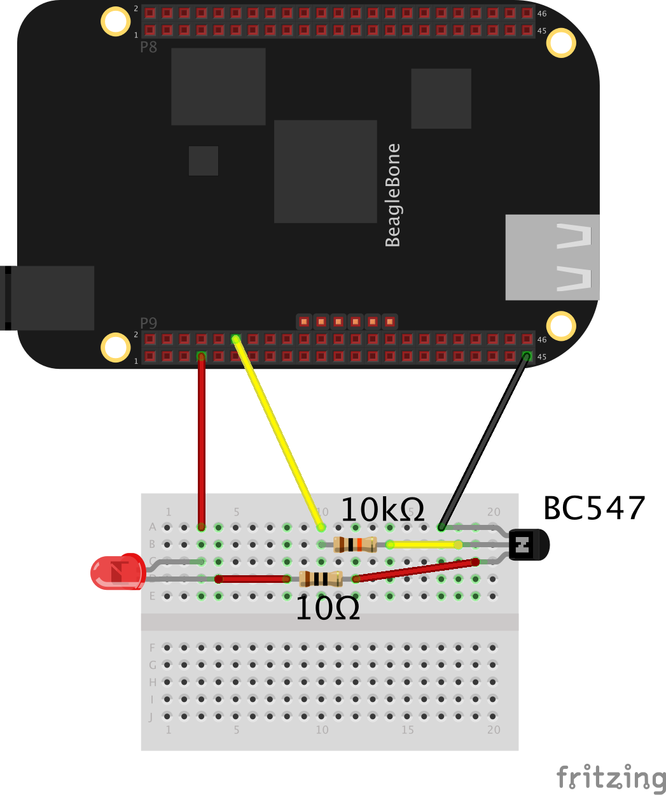
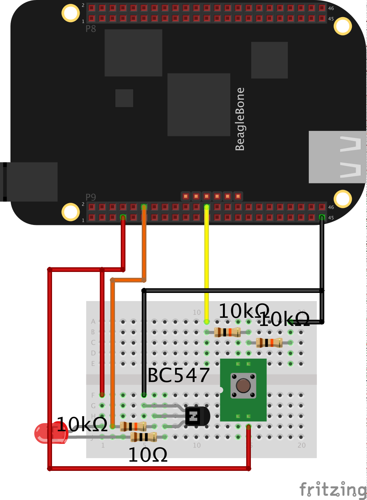

The 3 examples are:
* gpio led 
  Simple example flashing a led for 60 times. 
   
  <a href="https://youtu.be/2-JK1CCZhIM" target="_blank">Youtube</a>
* gpio input 
  Simple example reading the button state. 
   
  <a href="https://youtu.be/ftYPZDCvYo4" target="_blank">Youtube</a>
* gpio input driving a led 
   
  Simple example of a led showing the button state. 
  <a href="https://youtu.be/FbH0a9wsRd4" target="_blank">Youtube</a>