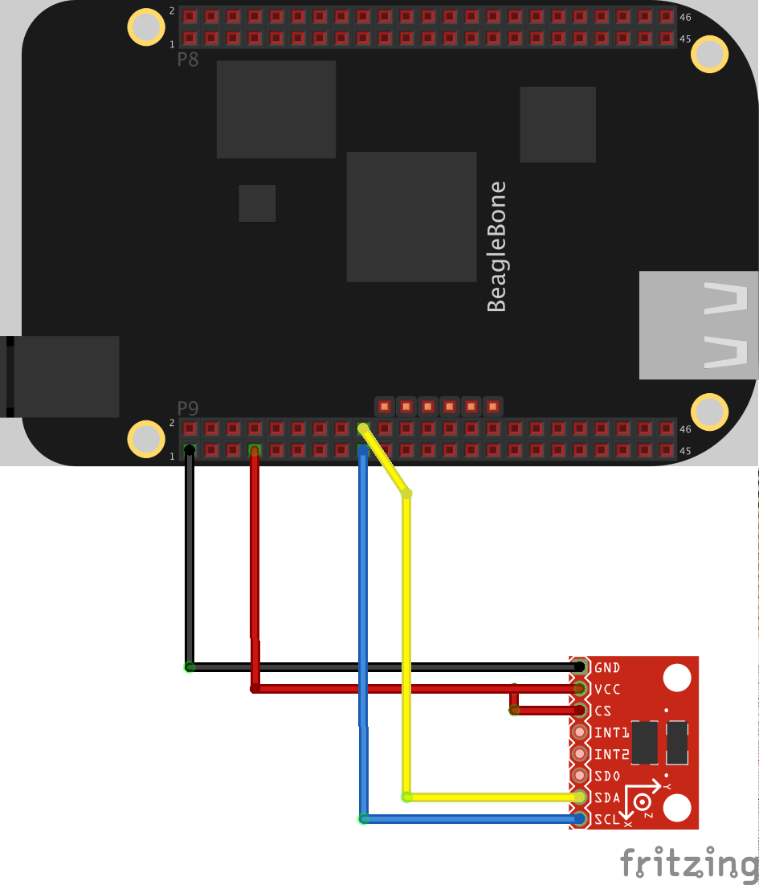
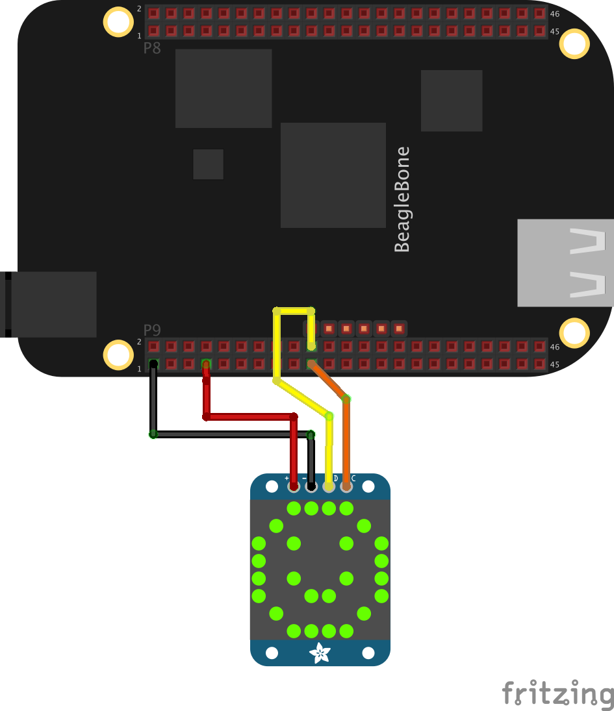

The beaglebone black has 2 i2c buses.

The 2 examples are:
* ADXL345 - accelerometer
   
  <a href="https://youtu.be/eVgUO5t4wLQ" target="_blank">Youtube</a>
* LED 8x8 Matrix
   
  <a href="https://youtu.be/Ri_gd2tgBCI" target="_blank">Youtube</a>