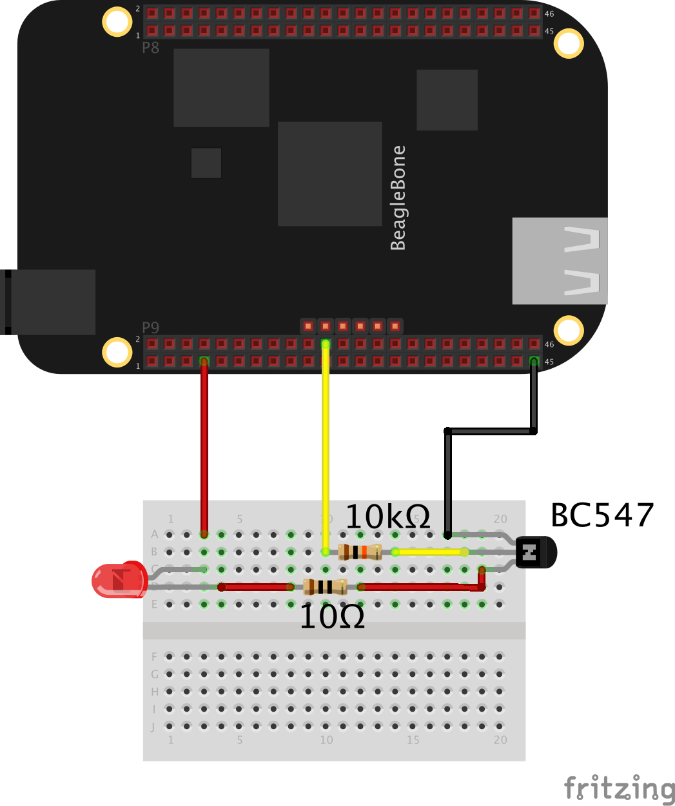

The BeagleBone has eight on-board pwm ports.

On the BeagleBone Black, we must enable pwm before we can use it.

To enable the pwm port on the P9 header, gpio 22, we first should disable the on board hdmi port: 
Rev A/B: Open the file /media/BEAGLEBONE/uEnv.txt in an editor (vim/nano) 
Rev C: Open the file /boot/uEnv.txt in an editor (vim/nano) 
Add the key "capemgr.disable_partno=" 
Add the ports you want to enable, comma separated (BB-UART1, BB-UART2. BB-UART4, BB-UART5) 
Reboot 
An example line looks like this: 
<pre><code>
root@beaglebone:/dev# cat /media/BEAGLEBONE/uEnv.txt 
cape_disable=capemgr.disable_partno=BB-BONELT-HDMI,BB-BONELT-HDMIN 
</code></pre>

After reboot, the device tree is no longer loading the HDMI and the pwm port(s) can be loaded. To list the device tree do:
cat /sys/devices/bone_capemgr.9/slots

<pre><code>
root@arm:/boot# cat /sys/devices/bone_capemgr.9/slots 
 0: 54:PF---  
 1: 55:PF---  
 2: 56:PF---  
 3: 57:PF---  
 4: ff:P-O-L Bone-LT-eMMC-2G,00A0,Texas Instrument,BB-BONE-EMMC-2G 
 5: ff:P-O-- Bone-Black-HDMI,00A0,Texas Instrument,BB-BONELT-HDMI 
 6: ff:P-O-- Bone-Black-HDMIN,00A0,Texas Instrument,BB-BONELT-HDMIN 
 </code></pre>
  