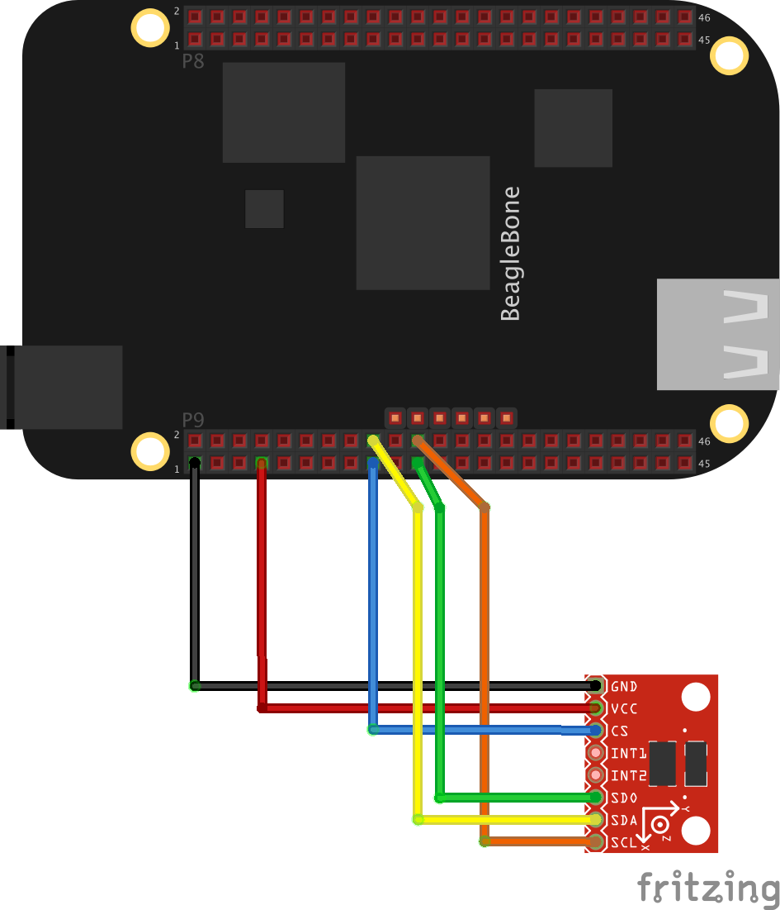
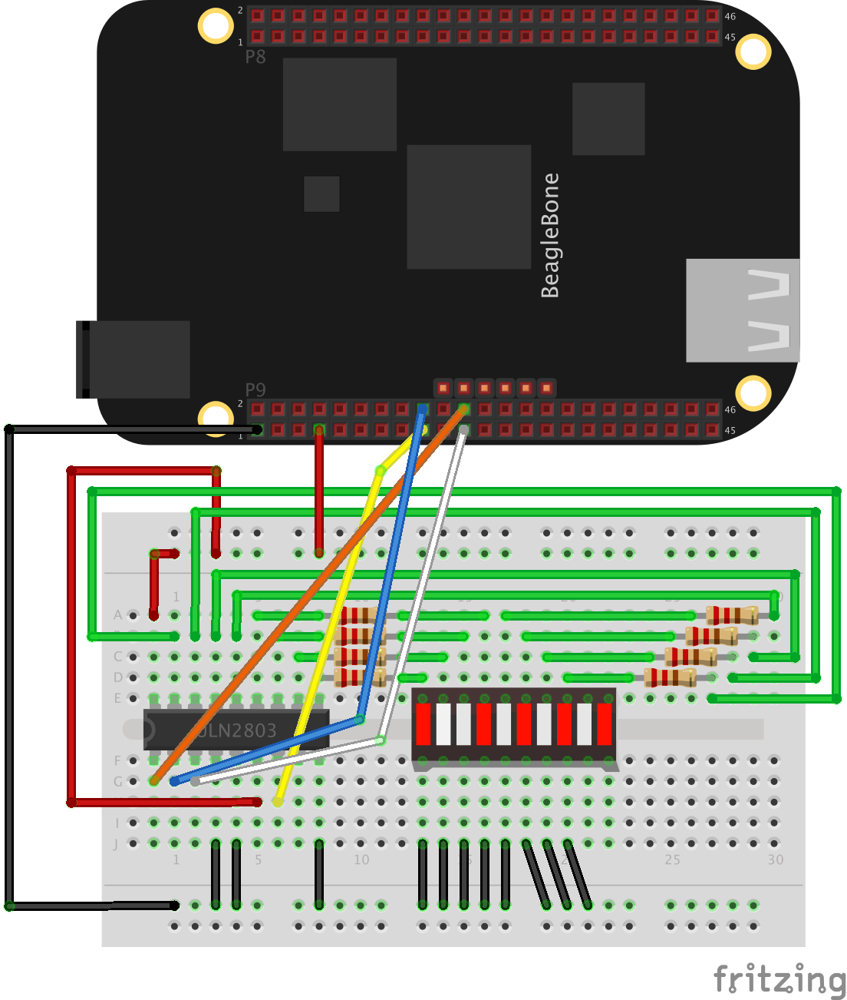
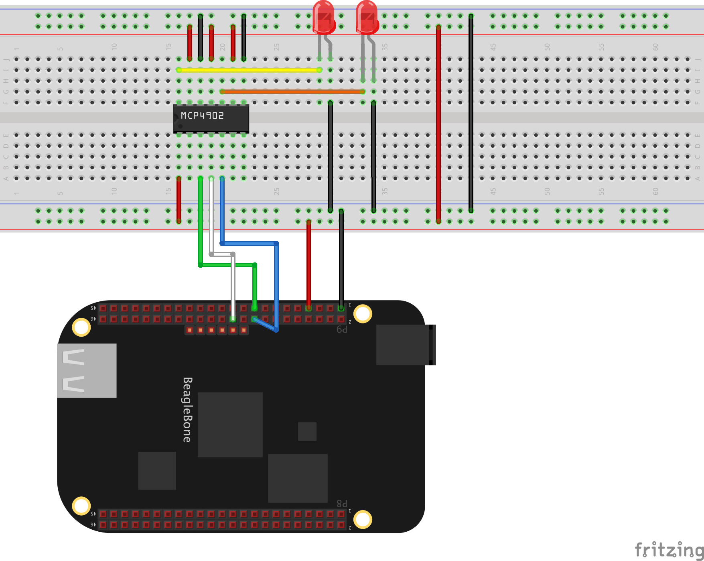

The beaglebone black has 2 spi buses.

The 4 examples are:
* ADXL345 
   
  <a href="https://youtu.be/m5WUDOjjX_c" target="_blank">Youtube</a>
* MCP23S08 
   
  <a href="https://youtu.be/hzkYUcrGF2A" target="_blank">Youtube</a>  
* MCP4902 
   
  <a href="https://youtu.be/X3ysMQEdu90" target="_blank">Youtube</a> 
* MCP23S08 -> MCP4902 -> TL082 
    
  MCP23S08 driving a MCP4902. The outputs from the MCP4902 are amplified by a TL082 
  <a href="https://youtu.be/yKDiBpzb08I" target="_blank">Youtube</a>