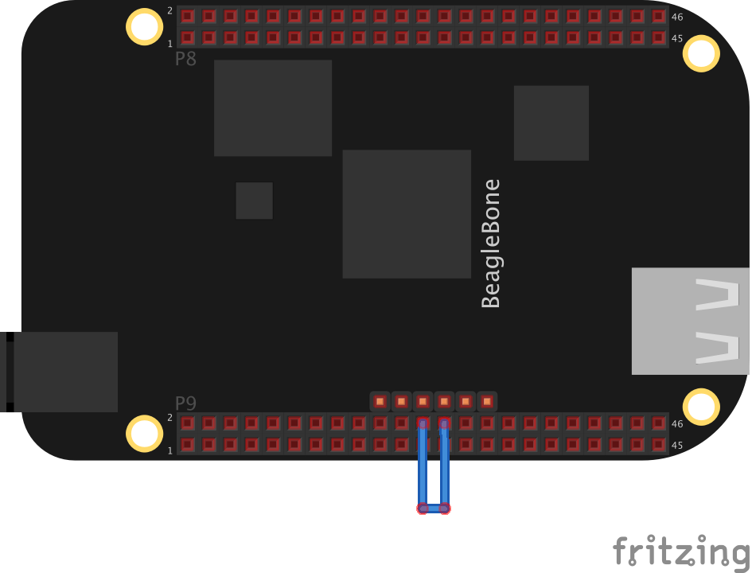

The BeagleBone has six on-board serial ports. 
 
On the BeagleBone Black, it's only the /dev/ttyO0 that is enabled by default, and it is coupled to the serial console. The other serial ports must be enabled before they can be used. 
 
To enable the uarts 1,2,4 and/or 5 on the BeagleBone Black, rev A, B and C: 
Rev A/B: Open the file /media/BEAGLEBONE/uEnv.txt in an editor (vim/nano) 
Rev C: Open the file /boot/uEnv.txt in an editor (vim/nano) 
Add the key "cape_enable=" 
Add the ports you want to enable, comma separated (BB-UART1, BB-UART2. BB-UART4, BB-UART5) 
Add the key "cape_disable" 
And add the BB-BONELT-HDMI and BB-BONELT-HDMIN 
Reboot 
An example line looks like this: 
<pre><code>
root@beaglebone:/dev# cat /boot/uEnv.txt 
cape_enable=capemgr.enable_partno=BB-UART1 
cape_disable=capemgr.disable_partno=BB-BONELT-HDMI,BB-BONELT-HDMIN 
</code></pre>
 
 
After reboot, the device is present in the device list: 
<pre><code>
 root@beaglebone:/dev# ls -l /dev/ttyO* 
 crw-rw---- 1 root tty     249, 0 Jan  1 01:18 /dev/ttyO0 
 crw-rw---- 1 root dialout 249, 4 Jan  1 01:18 /dev/ttyO4 
</code></pre>
 
The UARTs map to pins and devices like this: 
 
<pre><code>
 RX  TX  CTS   RTS   Device  Remark 
 UART0     J1_4  J1_5          /dev/ttyO0 BeagleBone Black only 
 UART1   P9_26   P9_24   P9_20   P9_19   /dev/ttyO1   
 UART2   P9_22   P9_21   P8_37   P8_38   /dev/ttyO2   
 UART3     P9_42   P8_36   P8_34   /dev/ttyO3  TX only 
 UART4   P9_11   P9_13   P8_35   P8_33   /dev/ttyO4   
 UART5   P8_38   P8_37   P8_31   P8_32   /dev/ttyO5   
</pre></code>

 